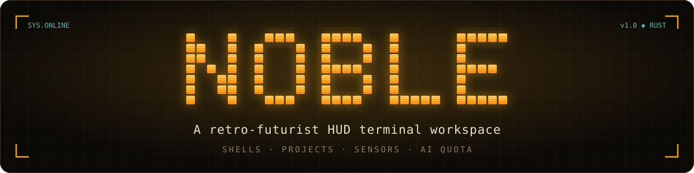
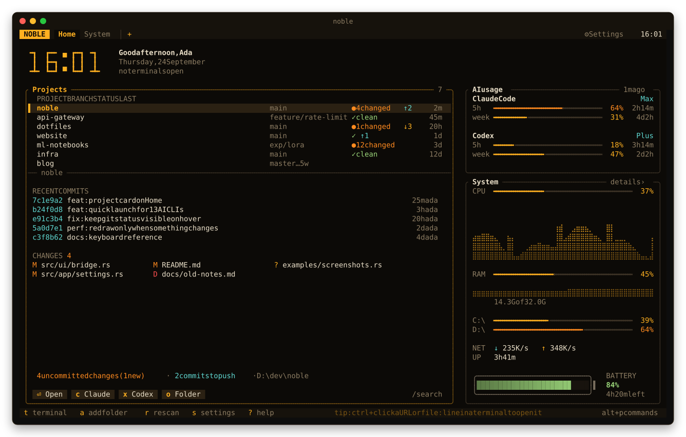
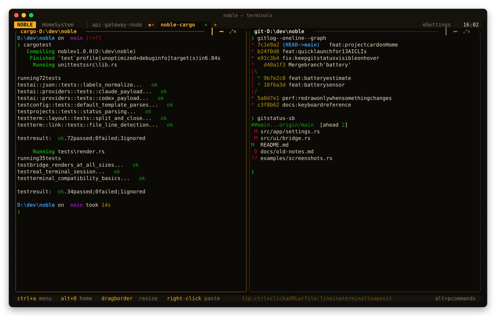
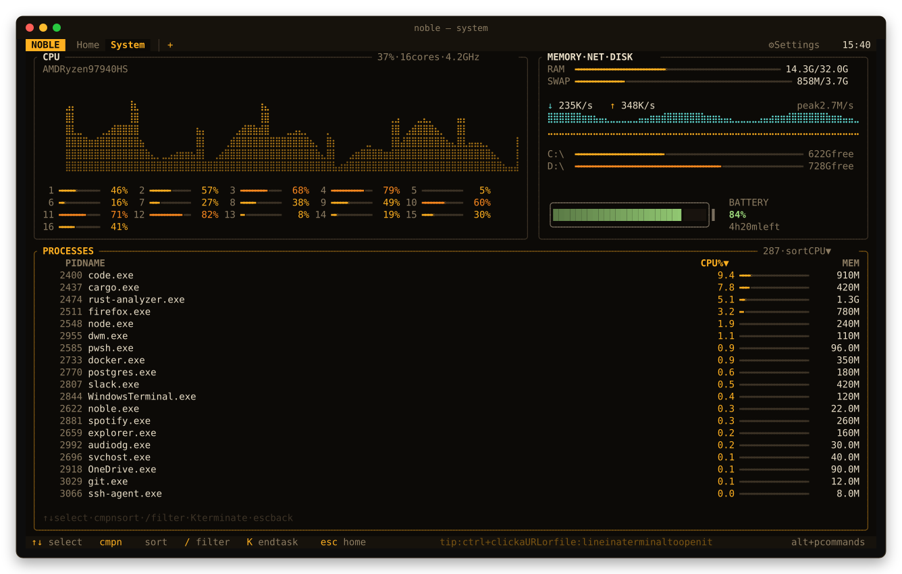
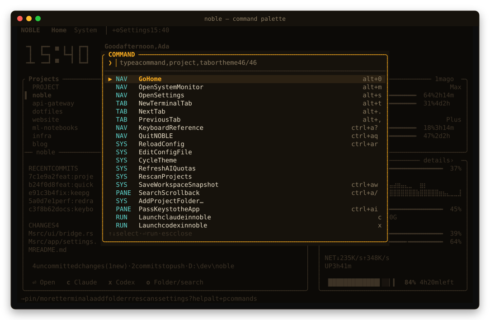
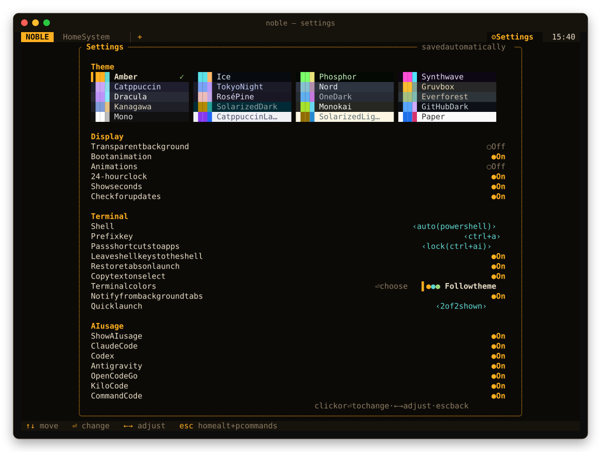
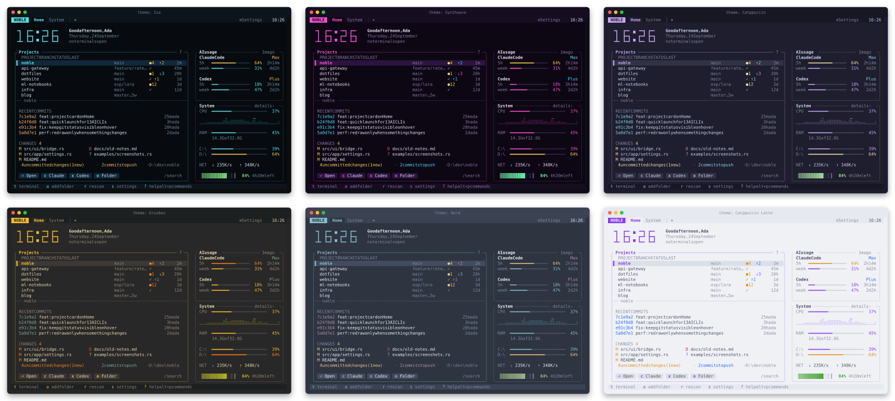

<p align="center">
  
</p>

<p align="center">
  <a href="https://github.com/MertSoylu/noble/actions/workflows/ci.yml"></a>
  <a href="https://github.com/MertSoylu/noble/releases"></a>
  <a href="https://crates.io/crates/noble"></a>
  
  
  <a href="LICENSE"></a>
  <a href="https://ratatui.rs/"></a>
</p>

<p align="center">
  <b>Real shells in tabs and splits, your git projects one keystroke away, live system sensors<br>
  and the remaining quota of your AI coding subscriptions, all in one cockpit that runs inside your terminal.</b>
</p>

<p align="center">
  <a href="https://noble.mertsoylu.dev"><b>Website</b></a> ·
  <a href="https://noble.mertsoylu.dev/docs">Docs</a> ·
  <a href="#-install">Install</a> ·
  <a href="#-features">Features</a> ·
  <a href="#-screens">Screens</a> ·
  <a href="#-keys">Keys</a> ·
  <a href="#-configuration">Configuration</a> ·
  <a href="#-ai-quota">AI quota</a> ·
  <a href="CONTRIBUTING.md">Contributing</a>
</p>

<p align="center">
  
</p>

NOBLE is a single native binary (Rust + [ratatui](https://ratatui.rs)) that turns your terminal into a
workspace: open a project and its shell with one key, start Claude Code or Codex right there, and keep
an eye on your git status, your CPU and how much of your 5-hour AI quota is left, without leaving the keyboard, or
the mouse, since everything is clickable.

It is also **light**: about 22 MB of RAM, and it only redraws when something visible changes. An idle terminal
tab costs about 0.05% of one core and the Home screen about 0.4%.

## ✨ Features

<table>
<tr>
<td width="50%" valign="top">

**🖥 Real terminals**<br>
ConPTY on Windows, a PTY on Linux. Tabs, splits, zoom, drag to resize, scrollback search, `ctrl+click` on URLs
and `file:line` paths. vim, htop and Claude Code run full-screen with mouse support.

</td>
<td width="50%" valign="top">

**📁 Projects at a glance**<br>
Finds your git repositories and shows branch, changes, commits to push or pull, recent commits and changed
files. The status refreshes as soon as a command finishes in that repository.

</td>
</tr>
<tr>
<td valign="top">

**🤖 AI quota and sessions**<br>
5-hour and weekly limits for Claude Code, Codex, Antigravity, OpenCode Go, Kilo Code and Command Code, read
from the logins the CLIs already keep. See which Claude session is working and which one is waiting for you.

</td>
<td valign="top">

**🚀 Quick launch**<br>
Start Claude Code, Codex, OpenCode, Copilot, Cursor, Cline and more in the selected project with a single
key. Only the CLIs installed on your PATH are shown.

</td>
</tr>
<tr>
<td valign="top">

**📊 System monitor**<br>
CPU history and per-core load, memory, network, disks, battery (with a time estimate when the OS has none)
and a sortable process table.

</td>
<td valign="top">

**🎨 20 themes, live config**<br>
Amber, Ice, Synthwave, Catppuccin, Tokyo Night, Nord, Gruvbox… Terminal panes follow the theme, a built-in
scheme or, on Windows, your Windows Terminal scheme. `config.toml` reloads live and a bad value never crashes
the app.

</td>
</tr>
<tr>
<td valign="top">

**🖱 Mouse first, keyboard too**<br>
Every button, tab, row and chip is clickable, with context menus on right-click. A tmux-style prefix key and
a command palette (`alt+p`) cover the keyboard side.

</td>
<td valign="top">

**💾 Sessions and workspaces**<br>
Tabs, splits and each shell's folder are restored on the next launch. Save named workspaces and reopen them
from the palette.

</td>
</tr>
</table>

## 📸 Screens

<p align="center">
  
</p>

<table>
<tr>
<td width="50%"><p align="center"><sub><b>System:</b> CPU, cores, memory, network, disks, battery, processes</sub></p></td>
<td width="50%"><p align="center"><sub><b>Command palette:</b> every action, project, tab and theme</sub></p></td>
</tr>
<tr>
<td width="50%"><p align="center"><sub><b>Settings:</b> saved to <code>config.toml</code> instantly</sub></p></td>
<td width="50%"><p align="center"><sub><b>Themes:</b> Ice, Synthwave, Catppuccin, Gruvbox, Nord, Latte</sub></p></td>
</tr>
</table>

## 📦 Install

**Prebuilt binaries:** download the archive for Windows (x86_64) or Linux (x86_64, ARM64) from the
[latest release](https://github.com/MertSoylu/noble/releases/latest), unpack it and put `noble` on your PATH.
The Linux binaries are static, so they run on any distribution.

**With Cargo** (Rust 1.88+):

```sh
cargo install noble
```

**From source:**

```sh
git clone https://github.com/MertSoylu/noble && cd noble
cargo install --path .
```

Then run `noble`. On the first launch a short welcome card shows what NOBLE found, the four keys worth knowing
and a choice of prefix key, so it doesn't clash with your shell.

**Updating:** NOBLE checks GitHub for a new release once a day and shows it at the bottom right. Click
**update** there, or run `noble update` (`noble update --check` only reports). It downloads the prebuilt
binary for your platform and replaces the installed one; restart NOBLE afterwards. Turn the check off with
`check_updates = false` or in Settings.

<details>
<summary><b>Terminal requirements and a Windows Terminal profile</b></summary>

<br>

Any truecolor terminal with a regular monospace font works, no Nerd Font needed: Windows Terminal, WezTerm,
Kitty, Alacritty, GNOME Terminal, Konsole, iTerm2. Cascadia Code / Cascadia Mono render every glyph NOBLE uses
(box drawing, block elements, braille).

Copy and paste use the system clipboard (Windows, X11 and Wayland). Without one, e.g. over SSH, copied text is
sent to your terminal with OSC 52, links are copied instead of opened, and files and the config open in a
terminal editor (`$EDITOR`, else nano or vim).

To open NOBLE in its own tab from the Windows Terminal dropdown:

```json
{ "name": "NOBLE", "commandline": "noble.exe", "icon": "⌂", "font": { "face": "Cascadia Mono" } }
```

```
noble [--config <path>] [--no-boot]
      --paths      print config and data locations
      --version    print version
```

</details>

> [!NOTE]
> Windows and Linux are both fully supported: CI runs the whole test suite, real terminals and end-to-end
> included, on both. macOS should build but is not tested yet. Reports and fixes are welcome.

## ⌨ Keys

NOBLE uses a tmux-style **prefix** (default `ctrl+a`; press it twice to send a literal `ctrl+a` to the shell)
plus a few direct shortcuts. Everything can be rebound, and `?` shows the live reference.

When an app in a pane needs one of NOBLE's own shortcuts (e.g. `alt+p`, `alt+m`), **prefix `i`** locks the
pane's keys: every shortcut goes to the app (🔒 KEYS on the pane) until prefix `i` again; the prefix itself keeps
working. With `passthrough = "once"` (Settings → Pass shortcuts to apps) there is no lock: prefix + a shortcut
(e.g. `ctrl+a alt+p`) sends just that key, and prefix `i` sends the next key.

| Direct | | Prefix, then | |
|---|---|---|---|
| `alt+1…9` | go to tab | `t` `c` | new tab |
| `alt+0` | Home | `v` `\|` | split right |
| `alt+t` | new tab | `s` `-` | split down |
| `alt+p` | command palette | `x` / `X` | close pane / tab |
| `alt+m` | system monitor | `z` | zoom pane |
| `alt+s` | settings | `S` | settings |
| `alt+z` | zoom pane | `← → ↑ ↓` `o` | move focus |
| `alt+o` | next pane | `shift+arrows` `H J K L` | move divider |
| `alt+.` / `alt+,` | next / previous tab | `n` `p` `1…9` `0` | tabs · Home |
| `shift+pgup/pgdn` | scrollback | `/` `f` | search scrollback |
| | | `<` `>` `.` | move tab left / right · pane menu (copy path, open folder …) |
| | | `i` | pass shortcuts to the app (lock / next key) |
| | | `,` `w` `:` `?` `r` `q` | rename · save workspace · palette · help · reload config · quit |

<details>
<summary><b>Per-screen keys and mouse</b></summary>

<br>

- **Home:** `↑↓` select project · `⏎` open terminal · `→` then `⏎` pin to top (★) or more actions (⋯) · `c` Claude · `x` Codex · other AI CLIs by their shortcut
  (Settings → Quick launch) · `/` search · `t` terminal at home · `o` open folder · `w` save workspace ·
  `a` add a project folder · `r` rescan / `R` refresh AI · `m` system · `s` settings · `q` quit.
- **Settings:** `↑↓←→` move · `⏎`/space change · `←→` also cycles values · `esc` back.
- **System:** `↑↓` select · `c m p n` sort by CPU / memory / pid / name (again to flip) · `/` filter ·
  `K` or `del` terminate (asks first) · `esc` back.
- **Search:** type to find (case-insensitive) · `⏎`/`↑` older match · `↓`/`shift+⏎` newer · `esc` close.
- **Mouse:** `ctrl+click` opens a URL (including OSC 8 hyperlinks) in the browser or a `path:line:col` in
  VS Code · right-click a tab, pane title or project for a menu · drag tabs to reorder, double-click to rename ·
  drag dividers · drag to select text (copied on release) · right-click pastes · wheel scrolls ·
  `shift+drag` selects even inside apps that capture the mouse.

AltGr symbols (`@ { } [ ] \ | ~ €` on Turkish, German, Polish… layouts) are passed through as characters,
not as `ctrl+alt` chords.

</details>

## 🔧 Configuration

`noble --paths` prints the locations (Windows: `%APPDATA%\noble\config.toml`, data in `%LOCALAPPDATA%\noble`;
Linux: `~/.config/noble/config.toml`, data in `~/.local/share/noble`; `NOBLE_HOME` moves both). The file is created with comments on first launch and **reloaded live** when saved.
Errors show up as a toast and never crash the app. Most options can also be changed from the Settings screen.

<details>
<summary><b>Full <code>config.toml</code> reference</b></summary>

```toml
[general]
theme = "amber"          # any of the 20 themes in Settings
transparent = false      # let the terminal's own background (blur/opacity) show
boot_animation = true
clock_24h = true
show_seconds = true
operator = ""            # name in the greeting; empty = your user name
check_updates = true     # look for a new release once a day and show it at the bottom right

[terminal]
shell = ""               # empty = pwsh → powershell → cmd on Windows, $SHELL elsewhere
shell_args = []
scrollback = 5000
restore_session = true
copy_on_select = true
colors = "windows-terminal"  # windows-terminal (your PowerShell scheme; the theme elsewhere) | theme | campbell | dark-plus | light-gray | "wt:<your scheme>" …
background = ""          # override the scheme's background, e.g. "#c8c8c8"
foreground = ""          # override the scheme's text color
notify = true            # toast + bell when a background tab needs attention
notify_after = 10        # report background commands that ran at least this many seconds (0 = off)

[keys]
prefix = "ctrl+a"
passthrough = "lock"     # "lock": prefix i locks a pane's keys to its app · "once": prefix + shortcut sends it
[keys.prefix_bindings]   # key after the prefix → action ("none" unbinds)
"%" = "split_right"
[keys.direct_bindings]   # global chords
"alt+v" = "split_right"

[projects]
roots = []               # empty = Desktop, Documents, source/repos, projects, code, dev, src, repos …
max_depth = 4
exclude = []

[ai]
enabled = true
refresh_minutes = 5
providers = ["claude", "codex", "antigravity", "opencode-go", "kilo", "command-code"]
warn_at = 90             # warn once when a quota window reaches this percent (0 = off)

[[launchers]]            # Home quick launch; hidden when `command` is not on PATH
key = "c"
name = "claude"
command = "claude"
show = true              # false hides it from Home (Settings → Quick launch)
# Defaults: claude c, codex x, opencode e, copilot i, agy g (Antigravity), pi v, omp b
# (oh-my-pi), freebuff f, grok z (Grok Build), cursor-agent u, command-code d, cline l, kilo n.
```

**Actions** for bindings: `bridge system settings new_tab close_tab next_tab prev_tab tab_1…tab_9 move_tab_left
move_tab_right split_right split_down close_pane zoom focus_left focus_right focus_up focus_down focus_next
resize_left resize_right resize_up resize_down pane_menu palette help quit reload_config open_config cycle_theme
refresh_ai rescan_projects rename_tab save_workspace scroll_up scroll_down search add_project_folder send_prefix
passthrough update dismiss_update`.

</details>

## 🤖 AI quota

Usage is read from the logins that the official CLIs already keep on your machine. **Tokens are sent only to
their own provider, never displayed or logged, and never refreshed by NOBLE** (so it cannot race the CLI's
own token rotation). The last good numbers are cached and shown with `~` until the next successful fetch.

| Provider | Shown | Source |
|---|---|---|
| Claude Code | 5-hour and weekly limits, plan | `~/.claude/.credentials.json` → Anthropic OAuth usage endpoint |
| Codex / ChatGPT | 5-hour and weekly limits, plan | `~/.codex/auth.json` + `codex app-server` (`account/rateLimits/read`) |
| Antigravity | 5-hour and weekly limits (the fuller pool) | `agy --print /usage --output-format json`; only runs when an `agy` login exists |
| OpenCode Go | 5-hour, weekly and monthly limits | `~/.local/share/opencode/auth.json` → `opencode.ai/zen/go/v1/usage` |
| Kilo Code | Kilo Pass credits this billing period | `~/.local/share/kilo/auth.json` → `api.kilo.ai` `kiloPass.getState` |
| Command Code | 5-hour and weekly limits, plan | `~/.commandcode/auth.json` → `api.commandcode.ai/alpha/billing/credits` |

Only providers you are signed in to (and that have a quota plan) are shown. Quotas are fetched **only while
the Home screen is open**: right away when you come back to it and then every `refresh_minutes`. While you work
in a terminal NOBLE makes no network calls. It also warns when, at the current pace, the 5-hour window would
fill up before it resets.

<details>
<summary><b>Claude Code session status (optional hooks)</b></summary>

<br>

Without help NOBLE can only guess whether a Claude session is busy. Turn on
**Settings → AI usage → Claude Code status hooks** and NOBLE adds a few hooks to `~/.claude/settings.json`
(a backup is written next to it; turning the setting off removes exactly those entries). Claude then runs
`noble hook <event>` on prompt / stop / notification / session start / session end. The command writes one
small file per pane into NOBLE's data folder and exits; outside NOBLE it does nothing. The Home screen then
lists every Claude session as **working**, **needs you** or **your turn**, and a background tab lights up the
moment Claude asks for permission.

</details>

<details>
<summary><b>Shell integration</b></summary>

<br>

NOBLE learns each pane's working directory from OSC 7 / OSC 9;9, with no setup:

- **PowerShell** (Windows and Linux): your existing prompt (oh-my-posh included) is wrapped to emit OSC 9;9.
- **cmd.exe**: a `PROMPT` that does the same, unless you already have one.
- **bash, zsh, fish** (Git Bash too): your own `~/.bashrc`, `.zshrc` or `config.fish` loads first, then a
  small hook reports OSC 7 on every prompt. Starship, oh-my-zsh and friends keep working. The hook scripts live
  in the data folder under `shell/`; pass `--norc` (bash), `-f` (zsh) or `--no-config` (fish) in `shell_args`
  to start the shell untouched.
- Any other shell whose prompt emits OSC 7 works too.

This is what lets splits open in the current directory and sessions restore where you left off. Each prompt (OSC 7, OSC 9;9 or OSC 133) also tells NOBLE
that the previous command finished: it refreshes that repository's git status and, for background tabs,
reports long-running commands. OSC 9 / OSC 777 notifications and the bell mark a background tab with `◆`.

</details>

## 🔋 Performance

There is no fixed frame rate. NOBLE redraws when an event changes something visible, at most 60 times a second
under heavy output. Everything else runs only while it is on screen:

- System sensors: every second on the System screen and on Home (every 2 s on battery), every 5 s elsewhere.
- Git status: when a command finishes, when Home opens, or when a repository changes.
- AI quota: only while Home is open.
- On battery the Home clock drops its seconds and the blinking colon.

## 🤝 Contributing

Bug reports, ideas and pull requests are welcome! See [CONTRIBUTING.md](CONTRIBUTING.md) for the development
setup, the architecture overview and the test suite (headless render snapshots at seven terminal sizes, real
PTY sessions and end-to-end tests of the compiled binary). Security issues: see [SECURITY.md](SECURITY.md).

## 📄 License

[MIT](LICENSE) © NOBLE contributors
