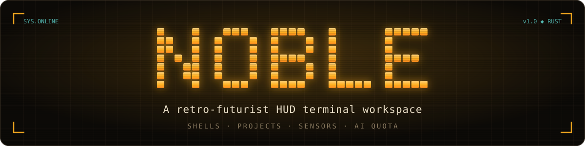
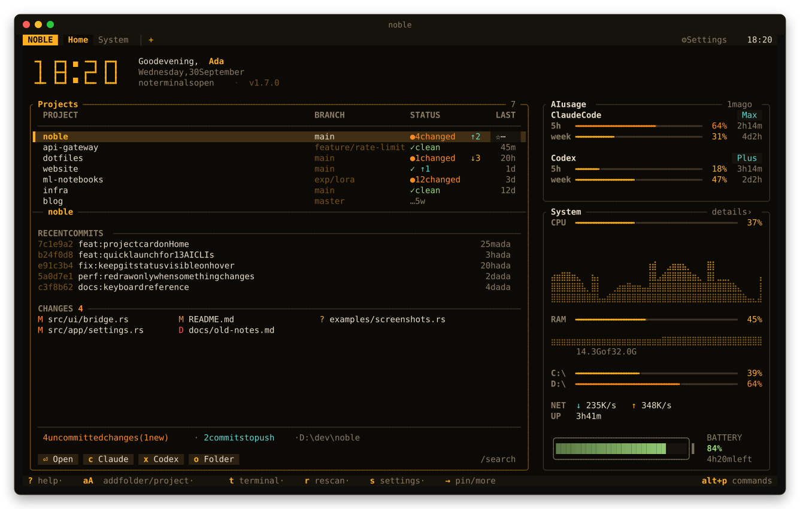
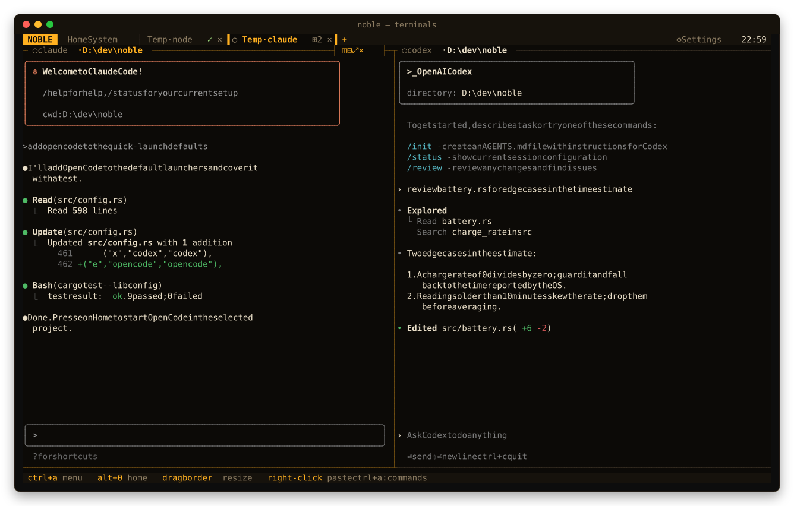
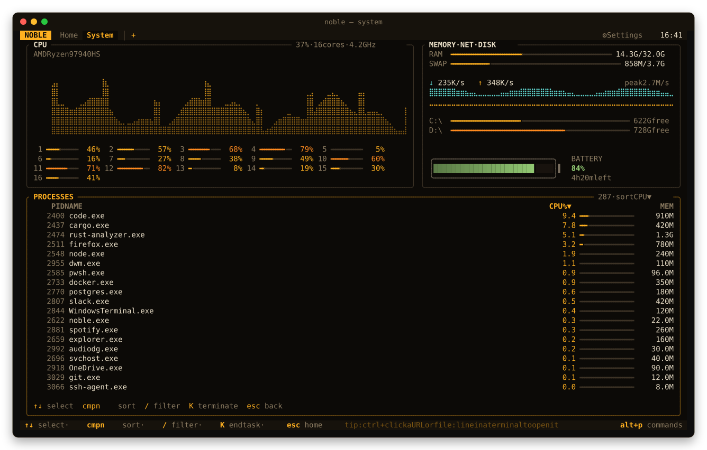
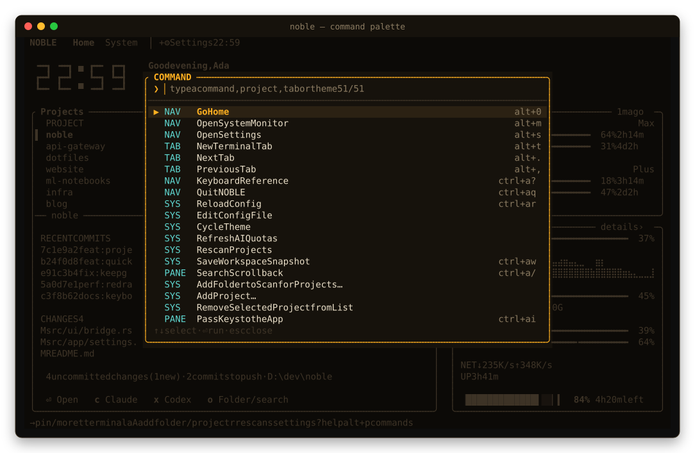
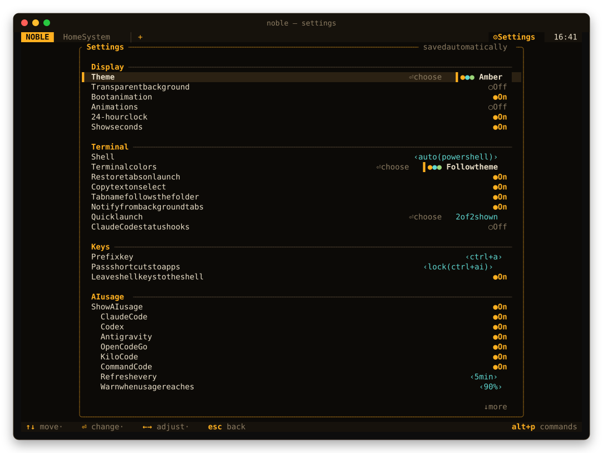
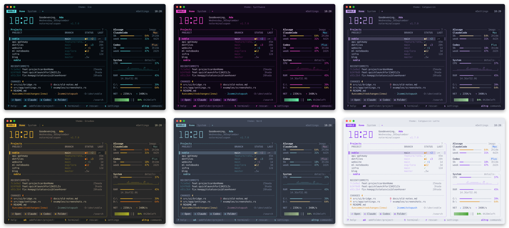

<p align="center">
  
</p>

<p align="center">
  <a href="https://github.com/MertSoylu/noble/actions/workflows/ci.yml"></a>
  <a href="https://github.com/MertSoylu/noble/releases"></a>
  <a href="https://crates.io/crates/noble"></a>
  
  
  <a href="LICENSE"></a>
  <a href="https://ratatui.rs/"></a>
</p>

<p align="center">
  <b>Real shells in tabs and splits, your git projects one keystroke away, live system sensors<br>
  and the remaining quota of your AI coding subscriptions, all in one cockpit that runs inside your terminal.</b>
</p>

<p align="center">
  <a href="https://noble.mertsoylu.dev"><b>Website</b></a> ·
  <a href="https://noble.mertsoylu.dev/docs">Docs</a> ·
  <a href="#-install">Install</a> ·
  <a href="#-features">Features</a> ·
  <a href="#-screens">Screens</a> ·
  <a href="#-keys">Keys</a> ·
  <a href="#-configuration">Configuration</a> ·
  <a href="#-ai-quota">AI quota</a> ·
  <a href="CONTRIBUTING.md">Contributing</a>
</p>

<p align="center">
  
</p>

NOBLE is a single native binary (Rust + [ratatui](https://ratatui.rs)) that turns your terminal into a
workspace: open a project and its shell with one key, start Claude Code or Codex right there, and keep
an eye on your git status, your CPU and how much of your 5-hour AI quota is left, without leaving the keyboard, or
the mouse, since everything is clickable.

It is also **light**: about 22 MB of RAM, and it only redraws when something visible changes. An idle terminal
tab costs about 0.05% of one core and the Home screen about 0.4%.

## ✨ Features

<table>
<tr>
<td width="50%" valign="top">

**🖥 Real terminals**<br>
ConPTY on Windows, a PTY on Linux and macOS. Tabs, splits, zoom, drag to resize, scrollback search, `ctrl+click` on URLs
and `file:line` paths. vim, htop and Claude Code run full-screen with mouse support. Each pane's title shows
how the last command ended (`✓ 2.4s`, `✗ 1 · 12s`) and a live timer while one runs. Scrolled back, a pane shows a
position bar with the search matches on it and a `↓ live · 12` chip counting the new lines below. The focused
or hovered pane shows its buttons on the title line: `◫` split right, `⊟` split down, `⤢` zoom, `✕` close.

</td>
<td width="50%" valign="top">

**📁 Projects at a glance**<br>
Finds your git repositories and shows branch, changes, commits to push or pull, recent commits and changed
files. The status refreshes as soon as a command finishes in that repository. Add any folder by hand (`A`) or
remove one you do not want (⋯ → Remove from list).

</td>
</tr>
<tr>
<td valign="top">

**🤖 AI quota and sessions**<br>
5-hour and weekly limits for Claude Code, Codex, Antigravity, OpenCode Go, Kilo Code and Command Code, read
from the logins the CLIs already keep. See which Claude session is working and which one is waiting for you,
on Home, in each pane's title and as a dot on its tab; prefix `a` jumps to the next agent waiting for you.

</td>
<td valign="top">

**🚀 Quick launch**<br>
Start Claude Code, Codex, OpenCode, Copilot, Cursor, Cline and more in the selected project with a single
key. Only the CLIs installed on your PATH are shown.

</td>
</tr>
<tr>
<td valign="top">

**📊 System monitor**<br>
CPU history and per-core load, memory, network, disks, battery (with a time estimate when the OS has none)
and a sortable process table.

</td>
<td valign="top">

**🎨 22 themes, live config**<br>
Amber, Ice, Synthwave, Catppuccin, Tokyo Night, Nord, Gruvbox… Terminal panes follow the theme, a built-in
scheme or, on Windows, your Windows Terminal scheme. `config.toml` reloads live and a bad value never crashes
the app.

</td>
</tr>
<tr>
<td valign="top">

**🖱 Mouse first, keyboard too**<br>
Every button, tab, row and chip is clickable, with context menus on right-click. A tmux-style prefix key and
a command palette (`alt+p`, prefix `:` in a terminal) cover the keyboard side.

</td>
<td valign="top">

**💾 Sessions and workspaces**<br>
Tabs, splits and each shell's folder are restored on the next launch; a folder that is gone or does not answer
(a dead network share) opens in home instead. With several NOBLE windows open, each one saves its own tabs and
the next launch brings back all of them; a window opened while another is running starts empty. Quick-launch
tabs run their command (e.g. `claude`) again. The session is saved a couple of seconds after every change and
when the window closes, the process is terminated or the OS logs off. Save named workspaces, reopen or delete
them from the palette. `noble .` (or `noble <folder>`) opens a shell tab in that folder.

</td>
</tr>
</table>

## 📸 Screens

<p align="center">
  
</p>

<table>
<tr>
<td width="50%"><p align="center"><sub><b>System:</b> CPU, cores, memory, network, disks, battery, processes</sub></p></td>
<td width="50%"><p align="center"><sub><b>Command palette:</b> every action, project, tab and theme</sub></p></td>
</tr>
<tr>
<td width="50%"><p align="center"><sub><b>Settings:</b> saved to <code>config.toml</code> instantly</sub></p></td>
<td width="50%"><p align="center"><sub><b>Themes:</b> Ice, Synthwave, Catppuccin, Gruvbox, Nord, Latte</sub></p></td>
</tr>
</table>

## 📦 Install

**Prebuilt binaries:** download the archive for Windows (x86_64), Linux (x86_64, ARM64) or macOS (Apple
Silicon, Intel) from the [latest release](https://github.com/MertSoylu/noble/releases/latest), unpack it and put
`noble` on your PATH. The Linux binaries are static, so they run on any distribution. The macOS binaries are
not notarized: a file downloaded with a browser needs `xattr -d com.apple.quarantine noble` once (not needed
with `curl` or `noble update`). Each archive has a `.sha256` file next to it: check it with
`sha256sum -c noble-linux-x86_64.tar.gz.sha256` on Linux, `shasum -a 256 -c noble-macos-aarch64.tar.gz.sha256`
on macOS, or compare it with `Get-FileHash noble-windows-x86_64.zip` in PowerShell on Windows.

**With Cargo** (Rust 1.95+):

```sh
cargo install noble
```

**From source:**

```sh
git clone https://github.com/MertSoylu/noble && cd noble
cargo install --path .
```

Then run `noble`. On the first launch a short welcome card shows what NOBLE found and the four keys worth
knowing, and lets you set up the basics in a few keystrokes: the theme and terminal colors (previewed live as
you cycle them with ←→), the shell when more than one is installed (PowerShell, cmd, Git Bash on Windows; bash,
zsh, fish … on Linux and macOS) and a prefix key that doesn't clash with your shell. ⏎ keeps your choices, esc
keeps the defaults; everything can be changed later in Settings.

**Updating:** NOBLE checks GitHub for a new release once a day and shows it at the bottom right. Click
**update** there, or run `noble update` (`noble update --check` only reports). It downloads the prebuilt
binary for your platform, checks it against the release's SHA-256 checksum (a mismatch or a missing checksum
stops the update and leaves the installed binary alone) and replaces the installed one; restart NOBLE afterwards. Turn the check off with
`check_updates = false` or in Settings.

<details>
<summary><b>Terminal requirements and a Windows Terminal profile</b></summary>

<br>

Any truecolor terminal with a regular monospace font works, no Nerd Font needed: Windows Terminal, WezTerm,
Kitty, Alacritty, GNOME Terminal, Konsole, iTerm2, Ghostty (and Terminal.app on macOS 26+; older versions
have no truecolor). Cascadia Code / Cascadia Mono render every glyph NOBLE uses
(box drawing, block elements, braille).

Copy and paste use the system clipboard (Windows, macOS, X11 and Wayland). Without one, e.g. over SSH, copied text is
sent to your terminal with OSC 52, links are copied instead of opened, and files and the config open in a
terminal editor (`$EDITOR`, else nano or vim).

To open NOBLE in its own tab from the Windows Terminal dropdown:

```json
{ "name": "NOBLE", "commandline": "noble.exe", "icon": "⌂", "font": { "face": "Cascadia Mono" } }
```

```
noble [--config <path>] [--no-boot]
      --paths      print config and data locations
      --version    print version
```

</details>

> [!NOTE]
> Windows, Linux and macOS are all supported: CI runs the whole test suite, real terminals and end-to-end
> included, on each of them. On macOS, turn on **Option as Meta** in your terminal for the `alt+` shortcuts
> (see Troubleshooting); the prefix works either way.

## ⌨ Keys

NOBLE uses a tmux-style **prefix** (default `ctrl+a`; press it twice to send a literal `ctrl+a` to the shell)
plus a few direct shortcuts. Everything can be rebound, and `?` shows the live reference.

The direct shortcuts marked \* are shell keys too (last argument, transpose words, fish's sudo and pager …), so in
a terminal they go to the shell and work everywhere else; use the prefix column there instead. `shell_first =
false` (Settings → Leave shell keys to the shell) gives them back to NOBLE everywhere.

When an app in a pane needs one of NOBLE's other shortcuts (e.g. `alt+m`, `alt+z`), **prefix `i`** locks the
pane's keys: every shortcut goes to the app (🔒 KEYS on the pane) until prefix `i` again; the prefix itself keeps
working. With `passthrough = "once"` (Settings → Pass shortcuts to apps) there is no lock: prefix + a shortcut
(e.g. `ctrl+a alt+m`) sends just that key, and prefix `i` sends the next key.

| Direct | | Prefix, then | |
|---|---|---|---|
| `alt+1…9` | go to tab | `t` `c` | new tab |
| `alt+0` | Home | `v` `\|` | split right |
| `alt+t`\* | new tab | `s` `-` | split down |
| `alt+p`\* | command palette | `x` / `X` | close pane / tab |
| `alt+m` | system monitor | `z` | zoom pane |
| `alt+s`\* | settings | `S` | settings |
| `alt+z` | zoom pane | `← → ↑ ↓` `o` | move focus |
| `alt+o` | next pane | `shift+arrows` `H J K L` | move divider |
| `alt+.` / `alt+,`\* | next / previous tab | `n` `p` `1…9` `0` | tabs · Home |
| `shift+pgup/pgdn` | scrollback | `/` `f` | search scrollback |
| | | `<` `>` `.` | move tab left / right · pane menu (copy path, open folder …) |
| | | `i` | pass shortcuts to the app (lock / next key) |
| | | `a` | jump to the next agent waiting for you (needs you first, then your turn) |
| | | `,` `w` `:` `?` `r` `q` | rename · save workspace · palette · help · reload config · quit |

<details>
<summary><b>Per-screen keys and mouse</b></summary>

<br>

- **Home:** `↑↓` select project · `⏎` open terminal · `→` then `⏎` pin to top (★) or more actions (⋯) · `c` Claude · `x` Codex · other AI CLIs by their shortcut
  (Settings → Quick launch) · `/` search · `t` terminal at home · `o` open folder · `w` save workspace ·
  `a` add a folder to scan · `A` add one project folder (git or not; `tab` switches between the two in the
  prompt) · ⋯ → Remove from list hides a project for good (`A` brings it back) · `r` rescan / `R` refresh AI ·
  `m` system · `s` settings · `q` quit.
- **Settings:** `↑↓` move · `⏎`/space change · `←` / `→` turn a switch off / on and step through values ·
  click the left half of a value or right-click to step back · the wheel scrolls the page · `esc` back to the page you came from.
- **System:** `↑↓` select · `c m p n` sort by CPU / memory / pid / name (again to flip) · `/` filter ·
  `K` or `del` terminate (asks first) · `esc` back.
- **Search:** type to find (case-insensitive) · `⏎`/`↑` older match · `↓`/`shift+⏎` newer · `esc` close.
- **Prompts and dialogs:** single-line prompts edit at a cursor (arrows, `home`/`end`, `del`, `ctrl+a/e/u`);
  confirmation dialogs need `y` (`n` or `esc` cancels), never `⏎`. `shift+⏎` sends a newline to AI CLIs
  (needs an outer terminal that reports Shift). The pane menu and palette can launch an agent in a split.
- **Notifications:** background alerts also go to the outer terminal as OSC 9 / OSC 777 desktop notifications
  while NOBLE is not in front (on Windows only when `TERM_PROGRAM` is set; Windows Terminal gets the bell).
- **Mouse:** `ctrl+click` opens a URL (including OSC 8 hyperlinks) in the browser or a `path:line:col` in
  VS Code (else Cursor, Windsurf or Zed, whichever is on the PATH; else the default app) · right-click a tab, pane title or project for a menu · drag tabs to reorder, double-click to rename,
  middle-click to close · the pane buttons `◫ ⊟ ⤢ ✕` (split right, split down, zoom, close) show on the focused
  pane and on the one under the mouse, and the status bar names the hovered one with its shortcut ·
  double-click a pane's title to zoom it (again to restore) ·
  drag dividers · drag to select text (copied on release), double-click a word, triple-click a line; the pane menu has Copy for a selection · right-click pastes (text with line breaks asks first unless the app uses bracketed paste) · wheel scrolls ·
  scrolled back, click the position bar in the pane's last column to jump there, or the `↓ live` chip (any key
  typed into the pane works too) to return to the newest output; the wheel keeps scrolling over both ·
  `shift+drag` selects even inside apps that capture the mouse.

AltGr symbols (`@ { } [ ] \ | ~ €` on Turkish, German, Polish… layouts) are passed through as characters,
not as `ctrl+alt` chords.

</details>

## 🔧 Configuration

`noble --paths` prints the locations (Windows: `%APPDATA%\noble\config.toml`, data in `%LOCALAPPDATA%\noble`;
Linux: `~/.config/noble/config.toml`, data in `~/.local/share/noble`; macOS: both in
`~/Library/Application Support/noble`; `NOBLE_HOME` moves both). The file is created with comments on first launch and **reloaded live** when saved.
Errors show up as a toast and never crash the app. Most options can also be changed from the Settings screen.

<details>
<summary><b>Full <code>config.toml</code> reference</b></summary>

```toml
[general]
theme = "amber"          # any of the 22 themes in Settings
transparent = false      # let the terminal's own background (blur/opacity) show
boot_animation = true
clock_24h = true
show_seconds = true
operator = ""            # name in the greeting; empty = your user name
check_updates = true     # look for a new release once a day and show it at the bottom right

[terminal]
shell = ""               # empty = pwsh → powershell → cmd on Windows, $SHELL elsewhere
shell_args = []
scrollback = 5000
restore_session = true
copy_on_select = true
tab_follows_cwd = true   # name a tab after its current folder (false: the folder it was opened in)
colors = "windows-terminal"  # windows-terminal (your PowerShell scheme; the theme elsewhere) | theme | campbell | dark-plus | light-gray | "wt:<your scheme>" …
background = ""          # override the scheme's background, e.g. "#c8c8c8"
foreground = ""          # override the scheme's text color
notify = true            # toast + bell when a background tab needs attention
notify_after = 10        # report background commands that ran at least this many seconds (0 = off)

[keys]
prefix = "ctrl+a"
passthrough = "lock"     # "lock": prefix i locks a pane's keys to its app · "once": prefix + shortcut sends it
shell_first = true       # alt+. alt+, alt+t alt+s alt+p go to the shell in a terminal
[keys.prefix_bindings]   # key after the prefix → action ("none" unbinds)
"%" = "split_right"
[keys.direct_bindings]   # global chords
"alt+v" = "split_right"

[projects]
roots = []               # empty = Desktop, Documents, source/repos, projects, code, dev, src, repos …
max_depth = 4
exclude = []             # folder names the scan skips
# Projects added with A and removed with ⋯ → Remove from list are kept in state.json, not here.

[ai]
enabled = true
refresh_minutes = 5
providers = ["claude", "codex", "antigravity", "opencode-go", "kilo", "command-code"]
warn_at = 90             # warn once when a quota window reaches this percent (0 = off)

[[launchers]]            # Home quick launch; hidden when `command` is not on PATH
key = "c"
name = "claude"
command = "claude"
show = true              # false hides it from Home (Settings → Quick launch)
# Defaults: claude c, codex x, opencode e, copilot i, agy g (Antigravity), pi v, omp b
# (oh-my-pi), freebuff f, grok z (Grok Build), cursor-agent u, command-code d, cline l, kilo n.
```

**Actions** for bindings: `bridge system settings new_tab close_tab next_tab prev_tab tab_1…tab_9 move_tab_left
move_tab_right split_right split_down close_pane zoom focus_left focus_right focus_up focus_down focus_next
resize_left resize_right resize_up resize_down pane_menu palette help quit reload_config open_config cycle_theme
refresh_ai rescan_projects rename_tab save_workspace scroll_up scroll_down search add_project_folder add_project
remove_project send_prefix passthrough jump_to_agent update dismiss_update`.

</details>

## 🤖 AI quota

Usage is read from the logins that the official CLIs already keep on your machine. **Tokens are sent only to
their own provider, never displayed or logged, and never refreshed by NOBLE** (so it cannot race the CLI's
own token rotation). The last good numbers are cached and shown with `~` until the next successful fetch.

| Provider | Shown | Source |
|---|---|---|
| Claude Code | 5-hour and weekly limits, plan | `~/.claude/.credentials.json` → Anthropic OAuth usage endpoint |
| Codex / ChatGPT | 5-hour and weekly limits, plan | `~/.codex/auth.json` + `codex app-server` (`account/rateLimits/read`) |
| Antigravity | 5-hour and weekly limits (the fuller pool) | `agy --print /usage --output-format json`; only runs when an `agy` login exists |
| OpenCode Go | 5-hour, weekly and monthly limits | `~/.local/share/opencode/auth.json` → `opencode.ai/zen/go/v1/usage` |
| Kilo Code | Kilo Pass credits this billing period | `~/.local/share/kilo/auth.json` → `api.kilo.ai` `kiloPass.getState` |
| Command Code | 5-hour and weekly limits, plan | `~/.commandcode/auth.json` → `api.commandcode.ai/alpha/billing/credits` |

Only providers you are signed in to (and that have a quota plan) are shown. Quotas are fetched **only while
the Home screen is open**: right away when you come back to it and then every `refresh_minutes`. While you work
in a terminal NOBLE makes no network calls. It also warns when, at the current pace, the 5-hour window would
fill up before it resets.

<details>
<summary><b>Claude Code session status (optional hooks)</b></summary>

<br>

Without help NOBLE can only guess whether a Claude session is busy. Turn on
**Settings → Terminal → Claude Code status hooks** and NOBLE adds a few hooks to `~/.claude/settings.json`
(a backup is written next to it once; the first Claude launch offers to turn this on; turning the setting off removes exactly those entries). Claude then runs
`noble hook <event>` on prompt / stop / notification / subagent start and stop / session start / session end.
The command writes one small file per pane into NOBLE's data folder and exits; outside NOBLE it does nothing.
The Home screen then lists every Claude session as **working**, **needs you** or **your turn**, and a
background tab lights up the moment Claude asks for permission. A session stays **working** while its
subagents (background ones too) still run, and Claude's idle reminder does not count as needing you. Hooks
set by an older NOBLE get the new events on the next start.

The pane title leads with the same state: `⠋ claude · working 2m +2` (a spinner, how long it has been working
and its running subagents), `◆ claude · needs you`, `● claude · your turn`, or `○ codex` for an agent NOBLE can
only recognize by name. Narrow panes keep the glyph and name, then the glyph alone. Each tab starts with a dot
for the most urgent state among its panes (◆ needs you, ● your turn, spinner working, ○ running). The spinner
only turns while a working agent is visible, its pane is printing (an interrupted session stays "working" until
its next prompt, but stops spinning) and the laptop is plugged in; otherwise it is a still `…`.
**Prefix `a`** (Jump to Waiting Agent) goes to the next pane, across tabs, whose agent needs you, else to the
next one whose agent finished its answer.

</details>

<details>
<summary><b>Shell integration</b></summary>

<br>

NOBLE learns each pane's working directory from OSC 7 / OSC 9;9, the last command's exit code from
OSC 133;D and when a typed command starts from OSC 133;C, with no setup:

- **PowerShell** (Windows, Linux and macOS): your existing prompt (oh-my-posh included) is wrapped to emit
  OSC 133;D (the exit code: 0, else `$LASTEXITCODE`, else 1) and OSC 9;9; your prompt still sees a failed
  command's `$?`. With PSReadLine (always there in an interactive session) the read-line call is wrapped to
  emit OSC 133;C before a line that is not blank runs.
- **cmd.exe**: a `PROMPT` that reports the directory, unless you already have one. cmd cannot report an exit
  code, so its panes show only how long a command took.
- **bash, zsh, fish** (Git Bash too): your own `~/.bashrc`, `.zshrc` or `config.fish` loads first, then a
  small hook reports the exit code (OSC 133;D) and the directory (OSC 7) on every prompt, and a typed command's
  start (OSC 133;C: `PS0` in bash 4.4+, `preexec` in zsh, `fish_preexec` in fish). Starship, oh-my-zsh and friends keep working, and so does a zsh
  `ZDOTDIR` of your own. A bash login shell (`-l` / `--login` in `shell_args`) loads `/etc/profile` and your
  `~/.bash_profile` (or `~/.bash_login` / `~/.profile`) instead of `~/.bashrc`. On macOS bash, zsh and fish
  start as login shells, as in Terminal.app and iTerm2 (`/etc/zprofile`, `~/.zprofile` and Homebrew's PATH
  load); any `shell_args` of your own replace that. The hook scripts live
  in the data folder under `shell/`; pass `--norc` (bash), `-f` (zsh) or `--no-config` (fish) in `shell_args`
  to start the shell untouched.
- Any other shell whose prompt emits OSC 7 works too.

This is what lets splits open in the current directory and sessions restore where you left off. Each prompt (OSC 7, OSC 9;9 or OSC 133) also tells NOBLE
that the previous command finished: it refreshes that repository's git status and, for background tabs,
reports long-running commands. A background tab gets a marker in the top bar, after its title, for the most
urgent thing that happened there: `◆` for an OSC 9 / OSC 777 notification, the bell or an agent that needs you, `✗`
for a command that ended with a non-zero exit code, `✓` for a long command that finished, `•` for plain output. It
clears when you open the tab. A split tab shows its pane count (`⊞2`) when the strip has room (in a narrow window
only on the active tab), and the active tab is framed by accent bars (`▌work ×▐`). When tabs do not fit, `+N`
keeps the most urgent marker of the hidden ones (`+3 ✗`).

The pane title shows the result of the last command typed at the prompt: `✓ 2.4s` when it worked,
`✗ 1 · 12s` with its exit code when it failed, `· 12s` in cmd.exe. It stays until the next command starts. A
command that runs longer than 2 s shows a live timer there instead (`◷ 0:07`, then `◷ 3m` updated once a
minute; on battery the first minute shows `◷` alone, so an idle pane still redraws at most once a minute).
The command start mark (OSC 133;C) tells a command that ran from an Enter on an empty, cleared or
continuation line, which records nothing; the time counts from when the command started, not from the first
line typed. cmd.exe and bash 3.2 (macOS `/bin/bash`) send no such mark: there the last Enter starts the
clock and a typed line counts as a command (a line typed and cleared again may repeat the last result).
On a narrow pane the title drops its folder first, then the tag, then this badge.

</details>

## 🩺 Troubleshooting

- **Splits and restored tabs open in the wrong folder:** the shell is not reporting its directory (see Shell
  integration above). cmd keeps a `PROMPT` you set yourself, so add `$E]9;9;$P$E\` to it; bash, zsh and fish
  started with `--norc`, `-f` or `--no-config` skip the hook; any other shell needs a prompt that emits OSC 7.
- **An AltGr symbol runs a NOBLE shortcut instead of typing:** a character that arrives with Ctrl+Alt (how
  Windows reports AltGr) is treated as text, and on Linux the terminal sends the character itself. If a key
  still triggers a shortcut, the terminal sends it as an `alt+` chord: unbind it (`"alt+…" = "none"` under
  `[keys.direct_bindings]`) or lock the pane's keys with prefix `i`.
- **`alt+` shortcuts type `π`, `¡` or `º` on macOS:** the terminal sends Option as a character. Turn on
  Option as Meta: Terminal.app Settings → Profiles → Keyboard → "Use Option as Meta key"; iTerm2 Profiles →
  Keys → Left Option key → Esc+; Ghostty `macos-option-as-alt = true`; Kitty `macos_option_as_alt yes`;
  Alacritty `option_as_alt = "Both"`. On layouts that type `@ { [ |` with Option, set it for the left Option
  key only. The prefix (`ctrl+a`) works without it.
- **The project list is empty on macOS:** macOS asks your terminal app for access to Desktop and Documents the
  first time NOBLE scans them. Allow it (System Settings → Privacy & Security → Files and Folders), or set
  `projects.roots` to folders outside them.
- **Colors look wrong or washed out:** NOBLE draws in 24-bit color. Use a truecolor terminal (Windows Terminal,
  WezTerm, Kitty, GNOME Terminal, Konsole, iTerm2 …) rather than the old Windows console, the Linux text console
  or Terminal.app before macOS 26; in
  tmux add `set -ag terminal-overrides ",*:RGB"`. Panes get `COLORTERM=truecolor`; their palette is Settings →
  Terminal colors (`terminal.colors`).
- **Copy does not reach your clipboard over SSH:** with no system clipboard NOBLE sends the text with OSC 52,
  which the terminal on your own machine has to allow (on by default in Windows Terminal, WezTerm and Kitty;
  tmux needs `set -g set-clipboard on`).

## 🔋 Performance

There is no fixed frame rate. NOBLE redraws when an event changes something visible, at most 60 times a second
under heavy output. Everything else runs only while it is on screen:

- System sensors: every second on the System screen and on Home (every 2 s on battery), every 5 s elsewhere.
- Git status: when a command finishes, when Home opens, or when a repository changes.
- AI quota: only while Home is open.
- On battery the Home clock drops its seconds and the blinking colon.

## 🤝 Contributing

Bug reports, ideas and pull requests are welcome! See [CONTRIBUTING.md](CONTRIBUTING.md) for the development
setup, the architecture overview and the test suite (headless render snapshots at seven terminal sizes, real
PTY sessions and end-to-end tests of the compiled binary). Security issues: see [SECURITY.md](SECURITY.md).

## 📄 License

[MIT](LICENSE) © NOBLE contributors
